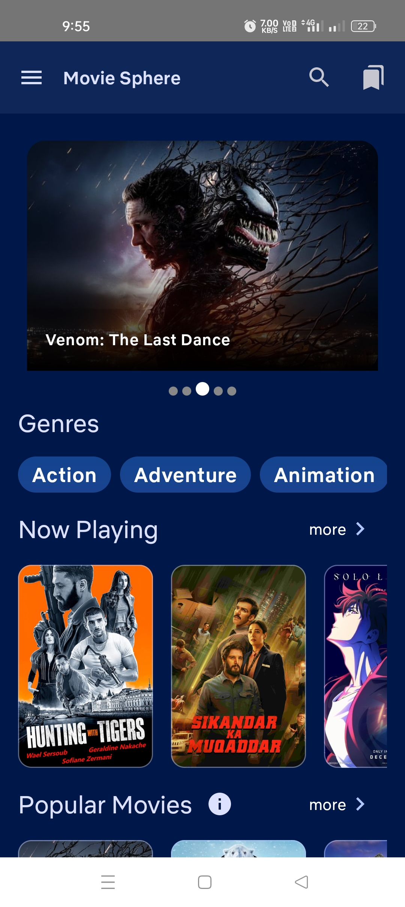
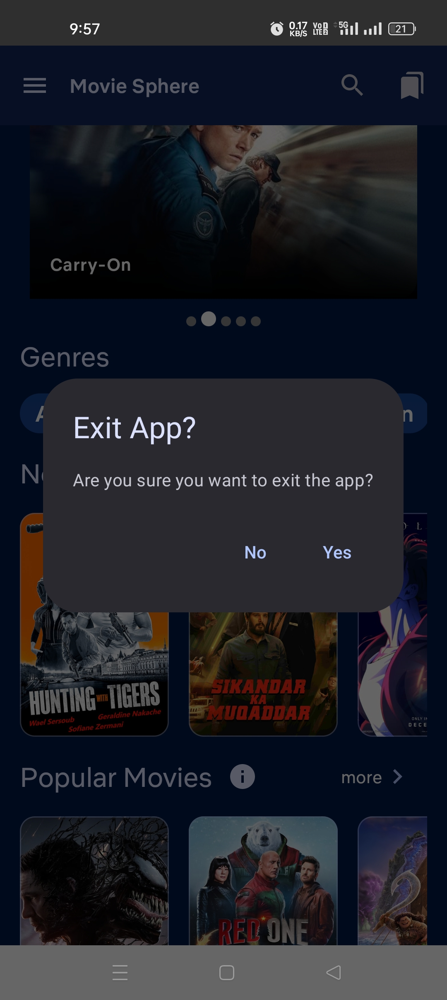
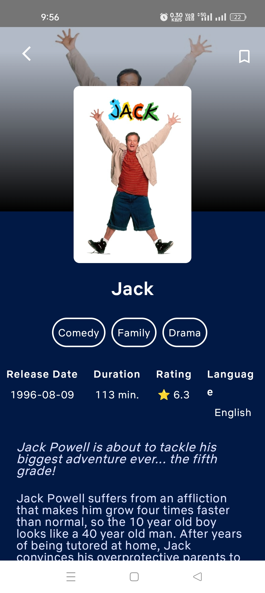
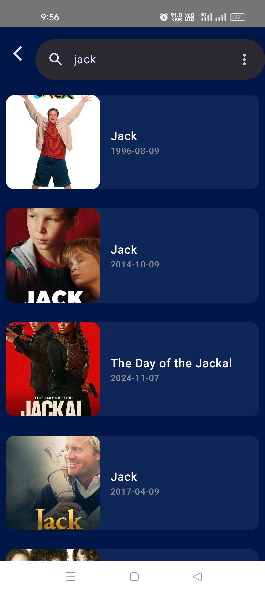
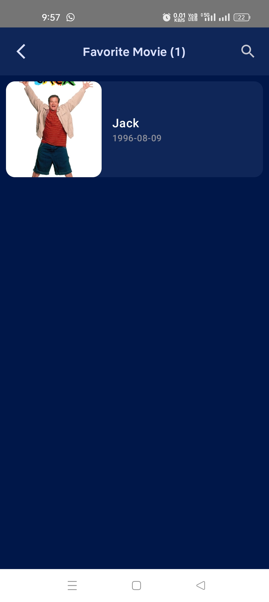

# Movie Sphere App
The app fetches movies from the TMDB API while leveraging the power of modern Android development with **Jetpack Compose** and other cutting-edge libraries.

### 💡 **Technologies Used:**
- **Jetpack Compose** – Modern UI Toolkit
- **TMDB API** – Fetch the latest movies, genres, and more!
- **Retrofit** – For seamless network calls
- **MVVM Architecture** – Clean, maintainable code structure
- **Hilt** – Efficient dependency injection
- **Paging3** – Effortless pagination for movie listings
- **Room DB** – Save and manage your Wishlist
- **Navigation** – Smooth navigation experience

## How It Works
1. **Home Screen**: The app starts with an automatic sliding banner featuring the latest movies. Below that, it shows a genres listing, followed by multiple movie sections like "Now Playing", "Popular Movies", "Discover", and "Upcoming Movies".
2. **Genres Listing**: Each genre features a scrollable list of movies displayed using **LazyColumn** and **Paging3** for seamless pagination.
3. **Movie Details**: Click on a movie to see details like its name, description, language, rating, and more.
4. **Search**: Use the search option to find any movie directly from the server.
5. **Favorite Movie**: Add your favorite movies to the list using **Room Database** and swipe to remove them easily.

## Libraries Used
- **Jetpack Compose**: Modern UI toolkit for building native Android UIs.
- **TMDB API**: Provides access to movies, TV shows, and cast information.
- **Retrofit**: Type-safe HTTP client for Android and Java.
- **MVVM Architecture**: Separates UI, business logic, and data management for easy maintainability.
- **Hilt**: Reduces the boilerplate of manual dependency injection.
- **Paging3**: Handles large data sets by loading content in chunks.
- **Room DB**: Local persistence for saving favorite movies.
- **Navigation**: Handles app navigation in a declarative way.
- **Coil**: Coil is an image loading library for Android.
- **Junit**: Provides annotations and assertions to create unit tests.
- **Mockito**: Helps simulate and control external dependencies in tests.

## How to Run
1. Clone the repository:
   ```bash
   git clone https://github.com/satyamkr01/MovieSphere.git
   ```
2. Open the project in Android Studio.
3. Add your **TMDB API Key** in the Constants file:
   ```properties
   API_KEY = TMDB_API_KEY
   ```
4. Build and run the app on an Android emulator or device.

## Screenshots
| Home Screen                         | Exit Popup                      | Now Playing Movies |
|-------------------------------------|---------------------------------| --- |
|  |  |  |

| Movie Details                      | Search Movies                     | Favorite Movie                      |
|------------------------------------|-----------------------------------|-------------------------------------|
|  |  |  |


